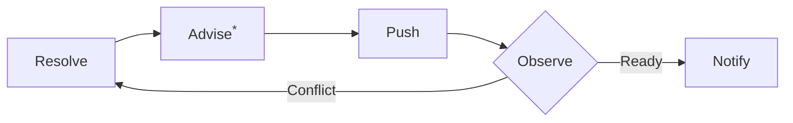

<div align="center">

# ROLL

**R**esolve, **O**bserve, **L**oop until ready to **L**and.

[](https://skills.sh/sumimakito/roll)

ROLL helps you resolve conflicts in a pull request, verify and/or test the resolution, observe PR checks and mergeability, and repeat until the PR is ready to merge.

</div>

## Why?

Although people say it is better to split the work and files, who can ensure everything is always clean and tidy? ROLL is here to help you hand off the PR and lean back until it's ready to merge, especially when you are working on a hot spot on a busy day.



<sup>*</sup>**Advise:** The optional advisory suggests changes to reduce potential conflicts in the future.

## Usage

Install ROLL with the skills.sh CLI:

```sh
npx skills add sumimakito/roll
```

Then ask your coding agent to use the `roll` skill from a checked-out GitHub PR
branch. Use a `roll-*` skill directly only when you need one phase.

Or…

Invoke `roll` from a checked-out PR branch. It confirms the PR target, asks for
setup settings, runs a capped resolve/verify/push/observe loop, and sends the
final notification.

Invoke a `roll-*` skill directly only when you need one phase rather than the
full run.

## Requirements

- Git repository with a GitHub pull request.
- Authenticated GitHub CLI: `gh auth status`.
- Shell access for `git`, `gh`, and project verification commands.
- Optional interactive selection UI such as `request_user_input`; otherwise the
  skills fall back to plain-text questions.

## Skills

- `roll`: runs the capped loop and dispatches each phase.
- `roll-resolve`: integrates the base branch with the confirmed `merge` or
  `rebase` strategy and resolves only safe conflicts.
- `roll-advisor`: optionally suggests ways to reduce future conflicts while
  preserving the PR's original goal.
- `roll-verify`: runs project tests or user-supplied verification before push.
- `roll-push`: pushes safely, using normal push for `merge` and
  `--force-with-lease` for `rebase`.
- `roll-observe`: watches checks while polling mergeability, with early conflict
  exit and capped retries.
- `roll-notify`: reports the final outcome in terminal, with optional OS or
  custom notifications.

## Structure

Each directory under `skills/` is a standalone Open Agent Skill:

```text
skills/
  roll/SKILL.md
  roll-advisor/SKILL.md
  roll-notify/SKILL.md
  roll-observe/SKILL.md
  roll-push/SKILL.md
  roll-resolve/SKILL.md
  roll-verify/SKILL.md
```

The `roll-*` skills are intentionally siblings, not nested subdirectories, so
they can be discovered and invoked independently by agents that support Open
Agent Skills.

## License

MIT. See [LICENSE](LICENSE).
