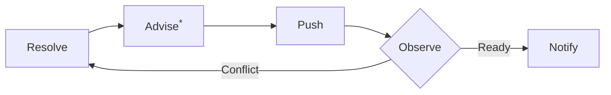

# ROLL

**R**esolve, **O**bserve, **L**oop until ready to **L**and.

## Why
Splitting work and files cleanly is ideal but rarely guaranteed. roll lets you
hand off the PR and lean back until it is ready to merge, especially on a busy
day with a hot spot.

***Advise:** The optional advisor suggests changes to reduce potential conflicts in the future.

## Interaction
Prefer interactive selection UI (`request_user_input` or host equivalent) for
every fixed-choice prompt: setup, observe confirmations, retry/stop, advisor
gates. If unavailable, ask plain text questions and note once that selection UI
is off and how to enable it (a host exposing `request_user_input`).

Setup must cover all four groups — target/reconciliation, advisory, notification,
observe — and never omit observe. Skip settings already confirmed. Parenthesized
names (e.g. `CONFLICT_POLL_INTERVAL`) are internal; phrase questions plainly and
never print them.

## Setup
Before mutating a branch:

**Target + reconciliation**
1. Detect target: `gh pr view --json number,headRefName,baseRefName,url`. Show
   PR, head, base, and URL; require confirmation or correction. If no PR exists,
   stop and ask whether to create one or use another target.
2. If head looks protected (`main`, `master`, `prod`, `production`, `release`,
   `develop`, `dev`, `release/*`, `hotfix/*`), require explicit extra
   confirmation. `roll-push` must re-check.
3. Ask how to reconcile the branch with base (`STRATEGY`): `merge` or `rebase`.
   Detect repo convention and propose a default, but never choose silently.
   `merge` uses normal push; `rebase` rewrites history and later requires
   `--force-with-lease`.

**Advisory settings**
4. Ask advisor mode: `off` default, `on`, or `ask-each-time`.

**Notification settings**
5. Ask notify channels: terminal always on; optional OS notification; optional
   custom command supplied now, not read from environment.

**Observe settings**
6. Ask how often to poll the base for conflicts (`CONFLICT_POLL_INTERVAL`),
   default 10 min. Note that checks are watched live; this interval is only the
   conflict backstop.
7. Ask whether to pause after each observe verdict before acting
   (`CONFIRM_EACH_OBSERVE`), default off.

## Loop
Caps: `MAX_ITERS` default 10; `MAX_WALL` default 60 min shared across the whole
run, including `roll-observe`. Every re-loop consumes an iteration.

1. If conflicted, run `roll-resolve`. If advisor enabled, run `roll-advisor`.
   Run `roll-verify`; on fail, do not push. Ask whether to retry via a new
   iteration.
2. Run `roll-push`. If rejected or failed, do not observe and never escalate to
   bare `--force`; loop back to fetch/resolve.
3. Run `roll-observe`. If `CONFIRM_EACH_OBSERVE` is on, show the verdict and
   wait for approval before acting.
4. Verdict handling:
   - `green`: success.
   - `conflicted`: loop.
   - `failed`: stop, report failing checks/logs, ask; do not auto-fix CI.
   - `review-blocked`: stop, report missing reviews/requirements.
   - `gave-up`: stop.
5. If any cap is hit, stop as `gave-up`.

## Finish
Run `roll-notify`:

| Loop result | Notify outcome |
|---|---|
| `green` | `merge-ready` |
| `failed` | `ci-failed` |
| `review-blocked` | `blocked` |
| `gave-up` or cap hit | `gave-up` |

## Dispatch
`roll-resolve`: conflicts. `roll-advisor`: optional future-conflict advice.
`roll-verify`: validation. `roll-push`: remote update. `roll-observe`: checks
and mergeability. `roll-notify`: final report.

## Stop Rules
- No branch mutation before target confirmation.
- No protected-looking force-push without explicit confirmation.
- No advisor when mode is `off`.
- No auto-fix for non-conflict CI failures.
- No uncapped loop.
